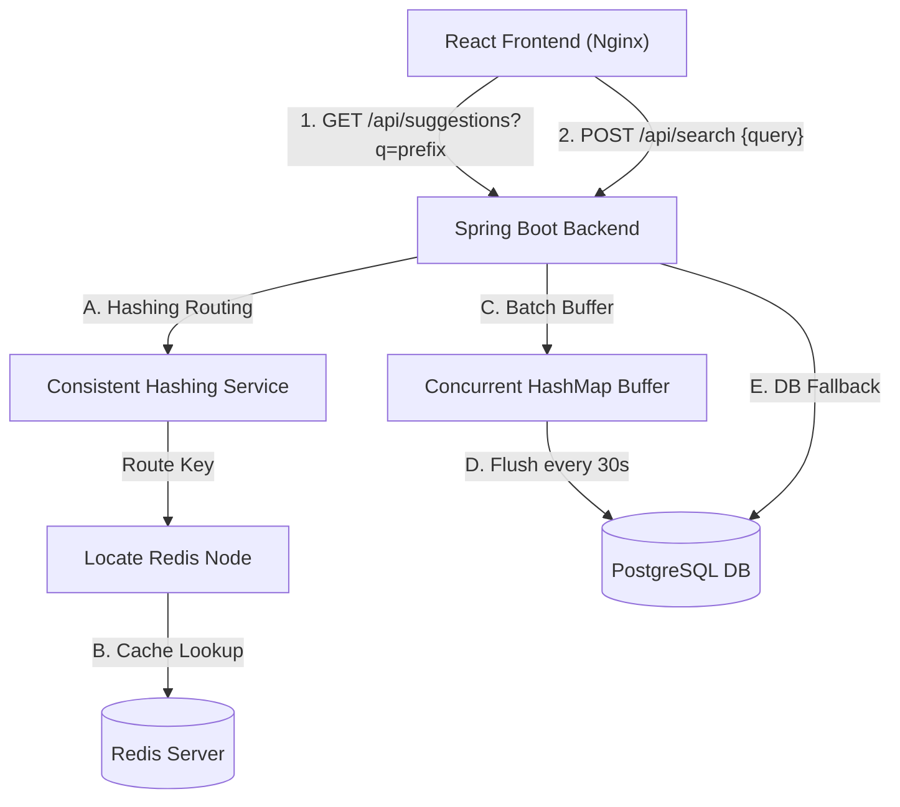

# Distributed Search Typeahead & Autocomplete System

A high-performance, containerized Search Autocomplete (Typeahead) system built with **Spring Boot 3**, **PostgreSQL**, **Redis**, and **React**. 

This project simulates a production-grade backend design using **Cache-Aside Caching**, a custom **Consistent Hashing Ring**, and **Aggregated In-Memory Write Buffering** to support high-throughput, low-latency search recommendations.

---

## 🏗️ System Architecture



### Key Architectural Pillars
1. **Consistent Hashing**: Suggestion keys are mapped onto a circular hash ring of simulated Redis servers (`RedisNode1`, `RedisNode2`, `RedisNode3`). This ensures cache keys are distributed evenly and avoids cache stampedes when scaling cache nodes.
2. **Cache-Aside Pattern**: Autocomplete reads check the consistent hashing node first in Redis. On a cache miss, the backend falls back to query PostgreSQL, updates Redis, and returns.
3. **In-Memory Write Aggregation**: Searches submitted by users are buffered and summed in-memory using a thread-safe map. A background Spring Scheduler flushes these queries to PostgreSQL every 30 seconds inside a single transaction, reducing database write load by up to 90%.

---

## 📁 Project Structure

```text
SearchTypeHead/
├── backend/
│   ├── src/main/java/com/example/typeahead/
│   │   ├── config/             # Redis, Task Scheduler, CORS config
│   │   ├── controller/         # REST Controllers
│   │   ├── model/              # JPA QueryEntry Entity
│   │   ├── repository/         # QueryEntryRepository (Prefix query + scoring)
│   │   └── service/            # Core business logic (Consistent Hashing, Buffer, etc.)
│   ├── src/main/resources/
│   │   ├── application.yml     # Database & Redis connection parameters
│   │   ├── schema.sql          # PostgreSQL DDL table script
│   │   └── data.sql            # Seed dataset containing 11 queries
│   ├── pom.xml                 # Maven configuration
│   └── Dockerfile              # Multi-stage Java 17 container build
│
├── frontend/
│   ├── src/
│   │   ├── App.jsx             # React App (Dropdown, Ring Visualizer, Telemetry)
│   │   ├── main.jsx            # React root mount
│   │   └── index.css           # Vanilla CSS dark-mode dashboard stylesheet
│   ├── index.html              # HTML entrypoint
│   ├── nginx.conf              # Nginx server configuration (Reverse proxies /api)
│   ├── package.json            # React & Axios configuration
│   ├── vite.config.js          # Vite config (defines reverse proxy)
│   └── Dockerfile              # Multi-stage Node build & Nginx deployment
│
├── docker-compose.yml          # Connects postgres, redis, backend, and frontend
├── PERFORMANCE_REPORT.md       # Benchmarks & trade-off analysis
└── VIVA_GUIDE.md               # 10 comprehensive Viva questions and answers
```

---

## ⚡ Setup & Execution

### Prerequisites
* [Docker](https://www.docker.com/) and `docker-compose` installed.

### Run with a Single Command
Navigate to the root directory and run:
```bash
docker-compose up --build
```
This will build and launch:
1. **PostgreSQL** on port `5432` (health-checked)
2. **Redis** on port `6379` (health-checked)
3. **Spring Boot Backend** on port `8080`
4. **React Frontend** on port `8081` (served by Nginx)

Once all containers show active, open your browser and navigate to:
👉 **[http://localhost:8081](http://localhost:8081)**

---

## 📡 REST API Documentation

### 1. Autocomplete Suggestions API
Retrieve top 10 search suggestions starting with a specific prefix, sorted by popularity.
* **Route**: `GET /api/suggestions?q=<prefix>`
* **CURL Request**:
  ```bash
  curl "http://localhost:8080/api/suggestions?q=ja"
  ```
* **Sample Response**:
  ```json
  ["java", "javascript"]
  ```

### 2. Search Submission API
Submit a search query. This increments the query's popularity count.
* **Route**: `POST /api/search`
* **Request Payload**:
  ```json
  { "query": "react" }
  ```
* **CURL Request**:
  ```bash
  curl -X POST -H "Content-Type: application/json" -d '{"query":"react"}' http://localhost:8080/api/search
  ```
* **Sample Response**:
  ```json
  { "message": "searched" }
  ```

### 3. Cache Telemetry Stats API
* **Route**: `GET /api/cache/stats`
* **Sample Response**:
  ```json
  {
    "hits": 45,
    "misses": 5,
    "totalRequests": 50,
    "hitRate": 90.0
  }
  ```

### 4. Consistent Hashing Ring Layout
* **Route**: `GET /api/hashing/ring`
* **Sample Response**:
  ```json
  [
    {
      "physicalNode": "RedisNode1",
      "virtualNodeName": "RedisNode1-VN-0",
      "hash": -1984251786
    }
  ]
  ```

---


